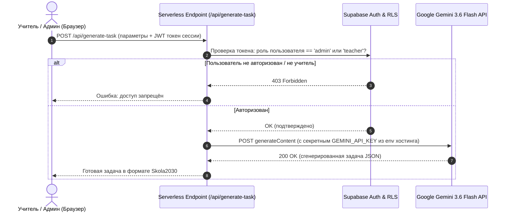

# Дорожная карта и спецификации будущих модулей (Future Roadmap)

> [!NOTE]
> Данный документ содержит спецификации, архитектурные схемы и архивные компоненты для трёх ключевых будущих направлений развития проекта **MathTasks**:
> 1. Серверная защита и безопасный прокси для API-ключа Google Gemini.
> 2. Личный кабинет учеников и система домашних заданий (LMS для учителей и учеников).
> 3. Модуль экзаменов, контрольных работ и симулятор с экзаменационным таймером.

---

## 1. 🔐 Архитектура безопасности: Серверный прокси для Gemini API

### 1.1. Проблема клиентского вызова
При прямом вызове Gemini API из браузера через `fetch('https://generativelanguage.googleapis.com/...')` API-ключ рискует стать доступным третьим лицам при передаче в бандле или публичных скриптах. Сейчас ключ изолирован в личном `localStorage` администратора, однако для продакшен-системы с несколькими учителями требуется серверная изоляция.

### 1.2. Архитектура Serverless Proxy



### 1.3. План реализации
1. **Перенос ключа в секреты хостинга:**
   - Для Cloudflare Pages: `wrangler secret put GEMINI_API_KEY` или через Dashboard → Settings → Environment variables (Encrypt).
   - Для Vercel / Netlify: Project Settings → Environment Variables.
2. **Активация [`functions/api/generate-task.js`](file:///C:/Users/goga8/Downloads/MathTasks/functions/api/generate-task.js):**
   - Добавить проверку заголовка `Authorization: Bearer <access_token>` через Supabase Auth (`supabase.auth.getUser(token)`).
   - Если пользователь подтверждён как администратор/учитель, шлём запрос к модели `gemini-3.6-flash`.
3. **Ограничение частоты запросов (Rate Limiting):**
   - Не более 15 генераций в минуту на аккаунт для защиты от исчерпания квоты.

---

## 2. 🎓 Личный кабинет учеников и модуль домашних заданий (LMS)

### 2.1. Концепция и роли пользователей
Система делится на две основные роли:
1. **Учитель (Администратор):**
   - Формирование домашнего задания из готовых задач базы или сгенерированных AI.
   - Назначение ДЗ конкретному классу или группе учеников с дедлайном.
   - Журнал успеваемости: просмотр статуса (сдано / в процессе / просрочено), набранных баллов и ответов ученика.
2. **Ученик:**
   - Регистрация и вход по email или логину класса (например, `8a_ivanov`).
   - Раздел «Мои задания»: список активных и завершённых ДЗ.
   - Интерактивное решение: ввод ответа с поддержкой KaTeX, автоматическая проверка формул через `compareAnswers()`.
   - Просмотр разобранного решения после сдачи или исчерпания попыток.

---

### 2.2. Схема базы данных Supabase (Будущая миграция)

```sql
-- 1. Таблица учебных групп / классов
create table public.classrooms (
  id bigint generated always as identity primary key,
  title text not null, -- Например: "8-A класс", "11 Optimālais"
  teacher_id uuid references public.profiles(id) on delete cascade,
  invite_code text unique not null, -- 6-значный код для присоединения учеников
  created_at timestamptz not null default now()
);

-- 2. Связка учеников с классами
create table public.classroom_students (
  classroom_id bigint references public.classrooms(id) on delete cascade,
  student_id uuid references public.profiles(id) on delete cascade,
  joined_at timestamptz not null default now(),
  primary key (classroom_id, student_id)
);

-- 3. Домашние задания
create table public.homeworks (
  id bigint generated always as identity primary key,
  classroom_id bigint references public.classrooms(id) on delete cascade,
  title text not null,
  description text,
  deadline timestamptz,
  is_published boolean not null default false,
  created_at timestamptz not null default now()
);

-- 4. Задачи, входящие в домашнее задание
create table public.homework_items (
  id bigint generated always as identity primary key,
  homework_id bigint references public.homeworks(id) on delete cascade,
  task_id bigint references public.tasks(id) on delete cascade,
  position int not null default 0,
  max_points int not null default 1
);

-- 5. Ответы и результаты учеников
create table public.homework_submissions (
  id bigint generated always as identity primary key,
  homework_id bigint references public.homeworks(id) on delete cascade,
  student_id uuid references public.profiles(id) on delete cascade,
  task_id bigint references public.tasks(id) on delete cascade,
  student_answer text,
  is_correct boolean not null default false,
  points_awarded int not null default 0,
  submitted_at timestamptz not null default now(),
  unique(homework_id, student_id, task_id)
);
```

---

### 2.3. Пользовательский интерфейс (UI)

1. **Для учителя (`admin.html` → Вкладка «Классы и ДЗ»):**
   - Кнопка «Создать ДЗ» → модальное окно: название, класс, срок сдачи.
   - Добавление задач галочками прямо из каталога или через «Сгенерировать вариант через AI».
   - Таблица мониторинга с прогресс-барами:
     | Ученик | Сдано задач | Оценка / Балл | Статус | Действие |
     | :--- | :---: | :---: | :---: | :--- |
     | Иванов А. | 5 / 5 | 100% | ✅ Сдано вовремя | [Проверить] |
     | Берзиньш К. | 3 / 5 | 60% | ⏳ В процессе | [Напомнить] |
2. **Для ученика (`student.html` или модальное окно кабинета):**
   - Карточки текущих домашних заданий с таймером обратного отсчёта до дедлайна.
   - Режим решения: последовательный показ задач, виртуальная клавиатура математических символов, мгновенная или отложенная проверка.

---

## 3. ⏱️ Экзаменационный модуль и архивный компонент таймера

### 3.1. Концепция раздела «Экзамены и проверочные работы»
Отдельная страница или вкладка для симуляции реальных экзаменов Латвии:
1. **Диагностическая работа (3 и 6 классы)** — 40 / 60 мин.
2. **Экзамен за 9 класс (Pamatskolas noslēguma darbs)** — 120 мин (2 часа).
3. **Экзамен за курс средней школы (Vispārīgais, Optimālais I, Augstākais II)** — 180 мин (3 часа).
4. Автоматическая блокировка ввода по завершении времени и воспроизведение звукового сигнала через Web Audio API.

---

### 3.2. Архив исходного кода таймера (HTML, CSS, JS)

#### HTML-разметка
```html
<div class="exam-timer-wrap" id="exam-timer-wrap">
  <button class="timer-topbar-btn" id="exam-timer-btn" type="button" title="Экзаменационный таймер" aria-label="Таймер">
    <span class="timer-topbar-icon" aria-hidden="true">⏱️</span>
    <span class="timer-topbar-digits" id="timer-display">00:00</span>
  </button>
  <div class="timer-dropdown" id="timer-dropdown" hidden>
    <div class="timer-dropdown-header">
      <span class="timer-dropdown-title">Экзаменационный таймер</span>
      <button type="button" class="timer-close-btn" id="timer-close-btn" aria-label="Закрыть">×</button>
    </div>
    <div class="timer-big-display" id="timer-big-display">00:00</div>
    <div class="timer-presets" role="radiogroup" aria-label="Режим таймера">
      <button type="button" class="timer-preset-btn active" data-timer-seconds="0">⏱️ Секундомер</button>
      <button type="button" class="timer-preset-btn" data-timer-seconds="2400">40 мин (Урок)</button>
      <button type="button" class="timer-preset-btn" data-timer-seconds="5400">90 мин (Работа)</button>
      <button type="button" class="timer-preset-btn" data-timer-seconds="7200">120 мин (9 класс)</button>
      <button type="button" class="timer-preset-btn" data-timer-seconds="10800">180 мин (12 класс)</button>
    </div>
    <div class="timer-controls">
      <button type="button" class="primary-button timer-action-btn" id="timer-toggle-btn">Старт</button>
      <button type="button" class="ghost-button timer-action-btn" id="timer-reset-btn">Сброс</button>
    </div>
  </div>
</div>
```

#### CSS-стилизация
```css
.exam-timer-wrap { position: relative; display: inline-flex; align-items: center; }
.timer-topbar-btn {
  display: inline-flex; align-items: center; gap: 6px; padding: 6px 12px;
  border-radius: 99px; border: 1px solid var(--border, #e2e8f0);
  background: var(--card-bg, #ffffff); color: var(--ink, #1e293b);
  font-family: monospace; font-size: 13px; font-weight: 700; cursor: pointer;
  transition: all 0.2s ease;
}
.timer-topbar-btn:hover { background: var(--chip-hover, #f1f5f9); border-color: #cbd5e1; }
.timer-topbar-btn.running { border-color: #3b82f6; color: #2563eb; background: rgba(59, 130, 246, 0.08); }
.timer-topbar-btn.warning {
  border-color: #ef4444; color: #dc2626; background: rgba(239, 68, 68, 0.1);
  animation: pulse-warn 1s infinite alternate;
}
@keyframes pulse-warn { from { transform: scale(1); } to { transform: scale(1.04); } }
.timer-dropdown {
  position: absolute; top: calc(100% + 8px); right: 0; width: 280px;
  background: var(--card-bg, #ffffff); border: 1px solid var(--border, #e2e8f0);
  border-radius: 12px; box-shadow: 0 10px 25px -5px rgba(0, 0, 0, 0.1);
  padding: 14px; z-index: 1000;
}
.timer-dropdown-header { display: flex; justify-content: space-between; align-items: center; font-size: 13px; font-weight: 700; margin-bottom: 10px; }
.timer-big-display { font-family: monospace; font-size: 36px; font-weight: 800; text-align: center; color: var(--ink, #0f172a); margin: 10px 0 14px; }
.timer-presets { display: flex; flex-direction: column; gap: 4px; margin-bottom: 14px; }
.timer-preset-btn {
  padding: 6px 10px; border-radius: 6px; border: 1px solid transparent;
  background: transparent; text-align: left; font-size: 12px; font-weight: 600;
  color: var(--muted, #64748b); cursor: pointer; transition: all 0.15s ease;
}
.timer-preset-btn:hover { background: var(--chip-hover, #f1f5f9); color: var(--ink, #1e293b); }
.timer-preset-btn.active { background: rgba(37, 99, 235, 0.08); border-color: rgba(37, 99, 235, 0.2); color: #2563eb; }
.timer-controls { display: flex; gap: 8px; }
.timer-action-btn { flex: 1; padding: 8px 0; font-size: 13px; text-align: center; }
```

#### JavaScript-контроллер (ExamTimer)
```javascript
const ExamTimer = {
  seconds: 0,
  initialSeconds: 0,
  isRunning: false,
  intervalId: null,

  init() {
    this.btn = document.querySelector('#exam-timer-btn');
    this.dropdown = document.querySelector('#timer-dropdown');
    this.display = document.querySelector('#timer-display');
    this.bigDisplay = document.querySelector('#timer-big-display');
    this.toggleBtn = document.querySelector('#timer-toggle-btn');
    this.resetBtn = document.querySelector('#timer-reset-btn');
    this.closeBtn = document.querySelector('#timer-close-btn');
    this.presetBtns = document.querySelectorAll('.timer-preset-btn');
    if (!this.btn || !this.dropdown) return;

    this.btn.addEventListener('click', () => { this.dropdown.hidden = !this.dropdown.hidden; });
    this.closeBtn?.addEventListener('click', () => { this.dropdown.hidden = true; });
    document.addEventListener('click', e => {
      if (!e.target.closest('#exam-timer-wrap')) this.dropdown.hidden = true;
    });

    this.presetBtns.forEach(btn => {
      btn.addEventListener('click', () => {
        if (this.isRunning) this.pause();
        this.presetBtns.forEach(b => b.classList.remove('active'));
        btn.classList.add('active');
        const sec = Number(btn.dataset.timerSeconds || 0);
        this.initialSeconds = sec;
        this.seconds = sec;
        this.updateDisplay();
      });
    });

    this.toggleBtn?.addEventListener('click', () => {
      if (this.isRunning) this.pause();
      else this.start();
    });

    this.resetBtn?.addEventListener('click', () => { this.reset(); });
    this.updateDisplay();
  },

  start() {
    if (this.isRunning) return;
    this.isRunning = true;
    this.btn.classList.add('running');
    this.btn.classList.remove('warning');
    if (this.toggleBtn) this.toggleBtn.textContent = 'Пауза';

    this.intervalId = setInterval(() => {
      if (this.initialSeconds === 0) {
        this.seconds++;
      } else {
        if (this.seconds > 0) {
          this.seconds--;
          if (this.seconds <= 60) this.btn.classList.add('warning');
          if (this.seconds === 0) this.finish();
        }
      }
      this.updateDisplay();
    }, 1000);
  },

  pause() {
    this.isRunning = false;
    this.btn.classList.remove('running');
    clearInterval(this.intervalId);
    if (this.toggleBtn) this.toggleBtn.textContent = 'Старт';
  },

  reset() {
    this.pause();
    this.btn.classList.remove('warning');
    this.seconds = this.initialSeconds;
    this.updateDisplay();
  },

  finish() {
    this.pause();
    this.btn.classList.add('warning');
    try {
      const ctx = new (window.AudioContext || window.webkitAudioContext)();
      const osc = ctx.createOscillator();
      const gain = ctx.createGain();
      osc.connect(gain);
      gain.connect(ctx.destination);
      osc.frequency.setValueAtTime(587.33, ctx.currentTime);
      gain.gain.setValueAtTime(0.2, ctx.currentTime);
      gain.gain.exponentialRampToValueAtTime(0.01, ctx.currentTime + 0.8);
      osc.start();
      osc.stop(ctx.currentTime + 0.8);
    } catch {}
  },

  updateDisplay() {
    const s = Math.max(0, Math.floor(this.seconds || 0));
    const mins = Math.floor((s % 3600) / 60);
    const secs = s % 60;
    const pad = n => String(n).padStart(2, '0');
    const str = `${pad(mins)}:${pad(secs)}`;
    if (this.display) this.display.textContent = str;
    if (this.bigDisplay) this.bigDisplay.textContent = str;
  }
};
```

---

## 4. 📌 Состояние на 6 сентября 2026 года

Чтобы этот документ не расходился с реальностью, здесь зафиксировано то, что уже сделано, и то, что мешает двигаться дальше. Цифры — из боевой базы, не по памяти.

| Что | Сколько |
| :--- | ---: |
| Разделов | 9 (задачи есть в 3) |
| Тем | 125 (задачи есть в 36) |
| Задач | 81, все опубликованы |
| Задач с чертежом | 0 |
| Языки | RU (базовый) + LV (весь каталог переведён) |

**Уже работает и не требует внимания:** карта сайта из базы, превью ссылок в мессенджерах, двуязычный интерфейс и каталог, поиск, режим печати, якорная навигация, фильтры и сортировка в панели, отложенная загрузка списка задач.

**Главное узкое место — не код, а содержимое.** 89 тем из 125 открываются пустыми. Сайт-решебник ценен объёмом; всё остальное в этом документе имеет смысл делать после того, как каталог перестанет зиять.

---

## 5. 🧭 Предложения к развитию

Ниже то, что я бы добавил, в порядке отношения пользы к трудозатратам. Это предложения, а не план: решать вам.

### 5.1. Дешёвое и заметное

**Разбор ошибок вместо «неверно».** Самопроверка сейчас отвечает «да/нет». Самое частое, чего не хватает ученику, — понять, где именно он свернул. Достаточно поля `hint_latex` у задачи и одной кнопки «Подсказка» между «Ответом» и «Решением»: третья ступень раскрытия к тем двум, что уже есть.

**Похожие задачи.** В конце страницы задачи — три-четыре из той же темы того же уровня сложности. Один запрос, никакой новой схемы, а глубина просмотра растёт заметно: ученик, решивший одну задачу, обычно готов решить вторую.

**Чертежи к геометрии.** Загрузка картинок работает и ни разу не использована. Геометрия за 7–9 класс без чертежей неполноценна — это не украшение, а часть условия.

**Заполнить пустые разделы.** Арифметика, Функции, Тригонометрия, Стереометрия, Логика, Математический анализ созданы, но пусты: все 125 тем лежат в Алгебре, Планиметрии и Статистике. Либо перераспределить темы, либо удалить лишние разделы — сейчас этосделанное решение.

### 5.2. Среднее по трудозатратам

**Прогресс без регистрации.** Отметка «решено» в браузере, полоса заполнения у темы. Ученику видно движение, а вам не нужны ни аккаунты, ни согласия на обработку данных несовершеннолетних. Это честный промежуточный шаг перед полноценным личным кабинетом из раздела 2.

**Печать варианта.** Режим печати уже есть для темы. Логичное продолжение — собрать произвольный набор задач в один лист с решениями или без: учителю нужна раздатка, и это ближайший путь к тому, чтобы сайтом начали пользоваться в школах.

**Формулы под рукой.** Справочник формул есть отдельной страницей. Он полезнее как выдвижная панель прямо на странице задачи: ученик не уходит со страницы, чтобы вспомнить формулу площади.

### 5.3. Крупное

Разделы 1–3 этого документа: серверная защита ключа, личный кабинет с домашними заданиями, экзаменационный модуль с таймером. Порядок я бы взял такой:

1. **Защита ключа** — маленькая работа, снимает единственный настоящий риск (см. 5.4).
2. **Экзаменационный модуль** — не требует аккаунтов вовсе, а ценность высокая: симулятор экзамена за 9 и 12 класс это то, ради чего ученик приходит сам. Таймер из раздела 3 уже написан.
3. **Личный кабинет** — самая большая работа, и она тянет за собой юридическую часть: аккаунты школьников означают политику приватности, согласия и хранение персональных данных. Браться стоит, когда появится конкретный учитель, готовый вести в этом класс.

### 5.4. Ключ Gemini: что сделано и что осталось

Прокси `/api/generate-task` **перенесён в воркер и работает** — раздел 1.2 этого документа описывает архитектуру, которая уже наполовину существует. Осталось два шага:

1. Задать ключ в секретах воркера: `npx wrangler secret put GEMINI_API_KEY`.
2. Переключить `public/ai-generator.js` с прямого вызова `generativelanguage.googleapis.com` на запрос к `/api/generate-task`, а поле ввода ключа из панели убрать.

Проверку роли через `supabase.auth.getUser(token)` из раздела 1.3 добавлять стоит **вместе** с этим переключением, иначе эндпоинт останется открытым: сейчас он никем не вызывается и потому безвреден, но с ключом в секретах станет бесплатным генератором для любого, кто узнает адрес.

### 5.5. Чего я делать не советую

**Аккаунтов учеников ради самих аккаунтов.** Пока нет учителя, который поведёт класс, кабинет из раздела 2 добавит юридических обязанностей больше, чем пользы. Прогресс в браузере (5.2) закрывает ту же потребность без персональных данных.

**Тёмной темы.** Её уже убирали как преждевременную. Возвращать стоит, когда сайтом начнут пользоваться вечерами — то есть после того, как появится трафик.

**Мобильного приложения.** Сайт открывается на телефоне и работает; приложение потребует отдельной сборки, магазинов и обновлений ради того же самого.

---

## 6. 🧱 Грабли этого проекта

Список того, что уже ломалось. Стоит перечитать перед крупной правкой.

- **Обратные слэши схлопываются.** Правки через heredoc дважды превращали `\\[` в `[`, а `\\b` — в символ забоя. Значения регулярных выражений после правки проверять вычислением, а не глазами.
- **`\b` не знает кириллицы.** В JavaScript граница слова определена только для латиницы, поэтому `/\bпредел/` не совпадает никогда. Для русских корней начало слова проверяется явно: `(?:^|[^а-яё])`.
- **Атрибут `hidden` перебивается авторским `display`.** Ломалось трижды. Каждому скрываемому блоку — парное правило `[hidden]{display:none}`.
- **Папка `functions/` не выполняется.** Это соглашение Cloudflare Pages, а проект на Workers. Серверный код живёт в `worker/index.js`.
- **`"type": "module"` в package.json.** `require('./public/lib.js')` вернёт пустоту. Проверять функции нужно через Vitest или выполняя файл как браузерный скрипт.
- **Списки в панели укорочены.** `tasks` и `topics` содержат не все колонки; перед правкой и выгрузкой полная строка добирается отдельным запросом. Новый код, читающий `task.condition_latex` из списка, получит `undefined`.
- **Рабочая копия в CRLF.** Многострочный поиск по файлу без нормализации концов строк не найдёт ничего.
